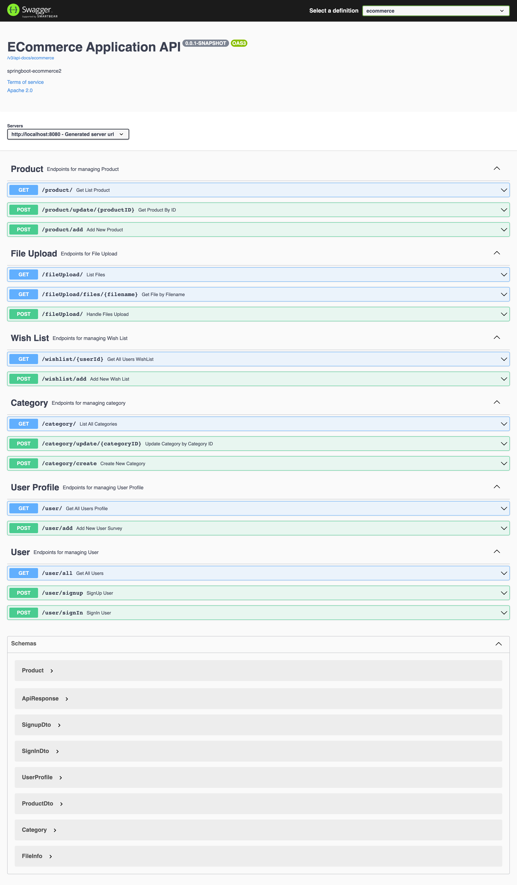

# springboot-ecommerce2

### Things todo list

1. Clone this repository: `git clone https://github.com/hendisantika/springboot-ecommerce2.git`
2. Navigate to the folder: `cd springboot-ecommerce2`
3. Make sure that your DB is UP & Running. Then change the application.properties file based on your credentials.
4. Run the application: `mvn clean spring-boot:run`

### Image Screen shot

Swagger UI

